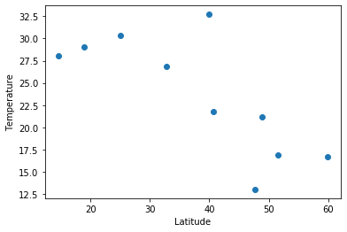
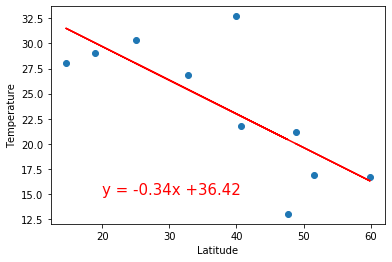

```python
# Dependencies
import matplotlib.pyplot as plt
import requests
from scipy import stats
import pandas as pd
from config import api_key
```


```python
# Save config information.
url = "http://api.openweathermap.org/data/2.5/weather?"
units = "metric"

# Build partial query URL
query_url = f"{url}appid={api_key}&units={units}&q="
```


```python
cities = ["Paris", "London", "Oslo", "Beijing", "Mumbai", "Manila", "New York", "Seattle", "Dallas", "Taipei"]

# set up lists to hold reponse info
lat = []
temp = []

# Loop through the list of cities and perform a request for data on each
for city in cities:
    response = requests.get(query_url + city).json()
    lat.append(response['coord']['lat'])
    temp.append(response['main']['temp'])

print(f"The latitude information received is: {lat}")
print(f"The temperature information received is: {temp}")
```

    The latitude information received is: [48.85, 51.51, 59.91, 39.91, 19.01, 14.6, 40.71, 47.61, 32.77, 25.05]
    The temperature information received is: [21.15, 16.92, 16.73, 32.7, 29, 28.05, 21.81, 13.02, 26.84, 30.36]
    


```python
# create a data frame from cities, lat, and temp
weather_dict = {
    "city": cities,
    "lat": lat,
    "temp": temp
}
weather_data = pd.DataFrame(weather_dict)
weather_data
```


<div>
<style scoped>
    .dataframe tbody tr th:only-of-type {
        vertical-align: middle;
    }

    .dataframe tbody tr th {
        vertical-align: top;
    }

    .dataframe thead th {
        text-align: right;
    }
</style>
<table border="1" class="dataframe">
  <thead>
    <tr style="text-align: right;">
      <th></th>
      <th>city</th>
      <th>lat</th>
      <th>temp</th>
    </tr>
  </thead>
  <tbody>
    <tr>
      <td>0</td>
      <td>Paris</td>
      <td>48.85</td>
      <td>21.15</td>
    </tr>
    <tr>
      <td>1</td>
      <td>London</td>
      <td>51.51</td>
      <td>16.92</td>
    </tr>
    <tr>
      <td>2</td>
      <td>Oslo</td>
      <td>59.91</td>
      <td>16.73</td>
    </tr>
    <tr>
      <td>3</td>
      <td>Beijing</td>
      <td>39.91</td>
      <td>32.70</td>
    </tr>
    <tr>
      <td>4</td>
      <td>Mumbai</td>
      <td>19.01</td>
      <td>29.00</td>
    </tr>
    <tr>
      <td>5</td>
      <td>Manila</td>
      <td>14.60</td>
      <td>28.05</td>
    </tr>
    <tr>
      <td>6</td>
      <td>New York</td>
      <td>40.71</td>
      <td>21.81</td>
    </tr>
    <tr>
      <td>7</td>
      <td>Seattle</td>
      <td>47.61</td>
      <td>13.02</td>
    </tr>
    <tr>
      <td>8</td>
      <td>Dallas</td>
      <td>32.77</td>
      <td>26.84</td>
    </tr>
    <tr>
      <td>9</td>
      <td>Taipei</td>
      <td>25.05</td>
      <td>30.36</td>
    </tr>
  </tbody>
</table>
</div>


```python
# Create a Scatter Plot for temperature vs latitude
x_values = weather_data['lat']
y_values = weather_data['temp']
plt.scatter(x_values,y_values)
plt.xlabel('Latitude')
plt.ylabel('Temperature')
plt.show()
```





```python
# Perform a linear regression on temperature vs. latitude
(slope, intercept, rvalue, pvalue, stderr) = stats.linregress(x_values, y_values)

# Get regression values
regress_values = x_values * slope + intercept
print(regress_values)
```

    0    20.009690
    1    19.115842
    2    16.293165
    3    23.013825
    4    30.036914
    5    31.518819
    6    22.744998
    7    20.426371
    8    25.413100
    9    28.007275
    Name: lat, dtype: float64
    


```python
# Create line equation string
line_eq = "y = " + str(round(slope,2)) + "x +" + str(round(intercept,2))
print(line_eq)
```

    y = -0.34x +36.42
    


```python
# Create Plot
plt.scatter(x_values,y_values)
plt.plot(x_values,regress_values,"r-")

# Label plot and annotate the line equation
plt.xlabel('Latitude')
plt.ylabel('Temperature')
plt.annotate(line_eq,(20,15),fontsize=15,color="red")

# Print r value
print(f"The r-value is: {rvalue**2}")

# Show plot
plt.show()
```

    The r-value is: 0.5596301896865264
    





```python
# Calculate the temperature for Florence at 43.77 degrees
florence_lat = 43.77
florence_predicted_temp = round(slope * florence_lat + intercept,2)
                                
print(f"The Predicted temperature for Florence will be {florence_predicted_temp}.")
```

    The Predicted temperature for Florence will be 21.72.
    


```python
# Use API to determine actual temperature
response = requests.get(query_url + "Florence").json()
florence_actual_temp = response['main']['temp']

print(f"The actual temperature of Florence is {florence_actual_temp}")
```

    The actual temperature of Florence is 30.86
    
