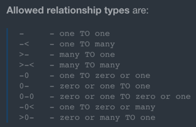

## Designing an ERD, Part II

In this activity, you and your partner will continue designing an entity relationship diagram for the gym by transitioning your logical ERD created in the previous activity to a physical ERD.

### Instructions

* Using the starter code provided, return to [Quick Database Diagrams](https://app.quickdatabasediagrams.com/#/) and transition your logical ERD to a physical ERD by creating the relationships between tables.

* When you are satisfied with your ERD, write a corresponding schema file containing your `CREATE TABLE` statements

* In pgAdmin, connect to your server and create a new database named `gym`. Then open a query tool.

* Paste the code from your schema file in pgAdmin, and then execute the code.

### Hints

* Foreign keys are added to each table represented by the `FK` acronym, followed by the relationship, e.g., `OrderID INT FK >- Order.OrderID`.

* You will need to add foreign keys to your tables in order to map the data relationships.

* Remember to document the relationships between entities using the correct symbols. Here are the allowed relationship types:

  

* Keep in mind the following:

  * Each member belongs to only one gym.
  * Trainers work for only one gym, but a gym has many trainers.
  * Each member must have a trainer, but each trainer may instruct multiple members.
  * Each member has one credit card on file.

* Once you have created tables in pgAdmin, you can check the table creation with the following syntax:

  ```sql
  SELECT * FROM Members;
  ```

* Populate your database with:
  * At least one gym
  * At least five members
  * At least two trainers
  * One credit card for each member
  * At two members assigned to each of the trainers

* Create a view that lists out all of the trainers along with their gym clients.
