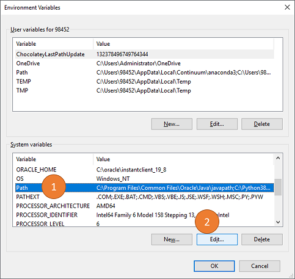
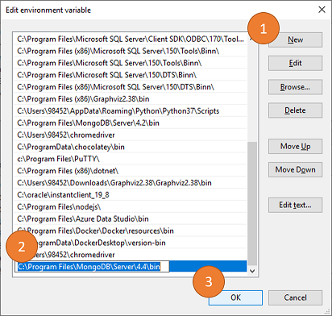

# Web Scraping and Document Databases

## Installation Prework
This document outlines the installation and configuration prework that is required for the Web Scraping and Document Databases module.

Please complete all of the installation steps *before class on Saturday* and post any issues in the `#homework` channel.

- - -

### MongoDB Community Edition and MongoDB Compass
#### **Step 1: Install MongoDB Community Edition**

* Windows: https://docs.mongodb.com/manual/tutorial/install-mongodb-on-windows/
* Mac: https://docs.mongodb.com/manual/tutorial/install-mongodb-on-os-x/

Please follow every step in the tutorial (please do not miss any steps), including the post-install set up steps.
  * **For Windows Users**: Be sure to create the `data` directory and add MongoDB to your system PATH environment variable. Please select the option to also install **MongoDB Community Edition**. If presented with the option. (If you were not presented with an option, then you will have the opportunity later.)
  * **For Mac Users**: Be sure to follow every step in the tutorial. Please select the option to also install **MongoDB Community Edition**. If presented with the option. (If you were not presented with an option, then you will have the opportunity later.)
  
The simple steps for **Mac Users** are below. Run these in your terminal:

1. Install x-code-select (if you do not already have it):
```
xcode-select --install
```

2. Install MongoDB through Homebrew:
```
brew tap mongodb/brew
brew tap | grep mongodb
brew install mongodb-community@4.4
```

3. To start MongoDB after installing, enter:
```
brew services start mongodb-community@4.4
```

Note: You will need to start `mongodb-community@4.4` if you want to work in MongoDB. To stop the service, you can enter `brew services stop mongodb-community@4.4` in your terminal. **If the simple steps do not work, then please follow the detailed steps in the tutorial above.**

#### **Step 2: Verify the MongoDB Community Edition Install**
Start up MongoDB by typing `mongod` into your terminal or bash windows. Your terminal/bash screens should look something like this:  


**WINDOWS USERS:** If your screen doesn't look like this image above, then you may need to add MongoDB to your PATH environment variable.
See the following steps:

1. Hit the Windows Key (or Start button) and type "PATH".  


2. From the System Properties screen, click the **Advanced Tab** and click the **Environment Variables** button.  


3. From the Environment Variables screen, in the System Variables panel, select "Path" from the list. Once "Path" has been selected, click the **Edit** button. 
*NOTE: If you do not have the permission to edit System Variables, then try editing the "Path" variable in the User Variables section above.*  


4. In the Edit Environment Variables screen, click new. Enter the MongoDB environment path, which should be `C:\Program Files\MongoDB\Server\4.4\bin` if you are using version 4.4 of MongoDB. Please feel free to replace the `4.4` in the PATH with the version that you are using. Once you have entered the MongoDB path, click OK to close out the configuration windows.  


5. Completely close all Command Prompt windows. Reopen a brand new Command Prompt window and try to type `mongod`. If the image still does not look like the image above, then notify the team and continue to move forward with testing your setup.

#### **Step 3 (OPTIONAL): Install MongoDB Compass**

**This step is only required if you did not install MongoDB Compass in step 1.**

If you did not install MongoDB Compass during the previous step, then you can install it separately by using these steps:

* Access the MongoDB Compass download page: https://www.mongodb.com/try/download/compass
* Select **Tools**
* After selecting On-Premises select **MongoDB Compass** as the product that you would like to download.
* Select the appropriate operating system, and proceed with the download and install.

- - -

### PyMongo, Splinter and ChromeDriver Setup

#### **Step 4: Test your Configuration**

In this final step, you will need to run a Jupyter Notebook to confirm that the script runs without error.

As part of the test, you will need to complete the following `pip` installs for the Unit 12.

These have all been included in the test scripts.

* `pymongo`, `bs4`, `lxml`, `webdriver_manager`, `html5lib`, `splinter`, and `chromedriver`

Depending on your operating system, run one of the scripts below in Jupyter Notebook:
* `WINDOWS_PyMongo_Splinter_Test.ipynb` for Windows users
* `MAC_PyMongo_Splinter_Test.ipynb` for Mac users

Run the entire script. If it completes without error, then you are all set. We will explain the code in the script during class.

**If you encounter an error, proceed to the Optional Step 6 below, and complete the manual ChromeDriver setup.** Once you have completed the manual ChromeDriver setup, completely close Jupyter Notebook, and all other Anaconda windows and completely restart Jupyter Notebook.

Once you have completely restarted Jupyter Notebook, retry the test script(s).

If you still encounter an error at this point, check the installation and configuration steps above and report your issue(s) to the #homework channel. Please work with your tutor and/or TAs for support.

#### **Step 5 (OPTIONAL): Manual Splinter and ChromeDriver setup**

**Follow these steps ONLY IF the test in Step 4 did not work.

To manually set up Splinter and ChromeDriver, please see [this document](https://splinter.readthedocs.io/en/latest/drivers/chrome.html) and ensure that all of the setup components have been addressed.

**Be sure to check your version of Google Chrome** to select the right version of ChromeDriver to install.

To check your version of Google Chrome, click Help > About Google Chrome from the menu bar in Chrome.

For **Windows Users**, you must follow the steps to download `ChromeDriver.exe`, place it in a folder on your machine and add that folder to your PATH environment variable.

- - -

### Support
As a reminder, please complete these installs **before class on Saturday**.

If you are having problems with installation or configuration. we've got several options to support you including: :
* I can run an optional installation and configuration session on Friday, December 11 at 6 pm for Windows Users and 6:45 pm for Mac users. I will record the sessions.
* Work with your TAs, Heather or Darick or your tutor to resolve install issues.
* During office hours on Saturday, breakout rooms will be set up before class during office hours.
* If you are having problems, I need to know ASAP. Please post any unresolved issues to the `#homework` channel.

Keep in mind that during class hours, there will be **no time will be allocated to installation and configuration**. However, breakout rooms will be available for anyone who may be having issues. We will only take ~10 to 15 minutes to verify installs.